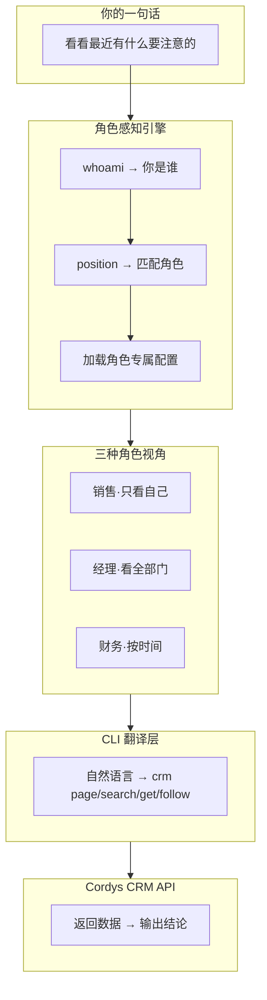

# Cordys CRM Skill

## CRM 助手的终极问题：它记得你是谁吗？

大多数 CRM 助手有一个共同的盲点——

> 它们把"查数据"和"看数据的人"割裂了。

一个销售和一个销售经理问同一个问题"看看线索"，得到的应该是不一样的答案：
- 销售想看的是「**我的**线索，哪些该跟进了」
- 经理想看的是「**团队的**线索，谁拖后腿了」

这不是偏好设置，而是**角色的本质差异**。

Cordys CRM Skill 解决的就是这个问题：**让 AI 在开口之前，先知道坐在屏幕前的是谁。**

---

## 这不是另一个"接入 CRM 的工具"

市场上已经有很多"能查 CRM 的 AI 助手"。它们的共同模式是：

> 你给我一个 API Key + 一段长篇大论的提示词，告诉我你是谁、想看什么、怎么展示。

Cordys CRM Skill 不需要长篇提示词。它只需要你输入 API Key，然后：
1. 自动调用 `GET /personal/center/info` 获取你的身份
2. 根据岗位自动匹配角色（销售、经理、财务）
3. 加载该角色的工作模式——查询范围、输出重点、预警规则
4. 开始对话，**就像你已经用了很久一样**

整个过程发生在 **3 次 API 调用之内**，不需要你写一个字。

---

## 它不是"给老板看的"，是谁用都顺手

很多 CRM 分析工具是为老板和管理层设计的——复杂的看板、多维度的交叉分析、高大上的可视化报告。

但真实的业务场景是：

| 角色 | 他关心的是 | 他不需要的是 |
|------|-----------|------------|
| 销售 | 今天哪几个客户该回访了 | 全公司的 KPI 仪表盘 |
| 销售经理 | 团队哪个成员转化率掉了 | 合同回款的精确对账 |
| 财务 | 哪些合同逾期未回款 | 团队排名和跟进率 |

Cordys CRM Skill 不预设用户角色。它发现你是谁，就按谁的视角工作。

---

## 它知道自己什么时候该说话

大多数 AI 助手的输出风格是：**用户问什么，它答什么。不多不少。**

但一个真正有用的业务助手，应该在用户发现问题之前就主动预警：

```
销售打开线索列表 →
  AI：您有 3 条线索超过 48 小时未跟进，其中 YYY 集团已 5 天未联系

经理查看团队数据 →
  AI：张三名下跟进率仅 40%，低于团队均值 68%

财务查看回款 →
  AI：合同 XX 项目回款已逾期 15 天，金额 ¥15 万
```

这不是"智能预测"，这是**角色感知的风险引擎**在自动工作——它知道不同角色关注不同风险，然后在你查询相关数据时顺带提醒。

---


## 怎么做到的




四个核心模块各自独立、互不耦合：

| 模块 | 职责 |
|------|------|
| **角色感知引擎** | 检测用户身份、匹配角色、管理 User.md 生命周期 |
| **CLI 语义规范** | 所有命令的定义、参数规则、意图映射 |
| **输出解释层** | JSON → 人类可读的转换规则、角色适配的输出格式 |
| **风险识别引擎** | 各角色的预警条件、触发时机、提醒优先级 |

---

## 三种角色，三种世界

### 销售
```
默认视角：我的客户/线索/商机
查询范围：lead, opportunity, account
输出侧重：操作建议——"联系谁 + 做什么 + 先后顺序"
主动预警：超期线索、商机卡点、今日计划未完成
```

### 销售经理
```
默认视角：全部门
查询范围：lead, opportunity, account, org, members
输出侧重：管理决策——排名 + 风险 + 建议
主动预警：跟进率过低、成员低产出、目标落后
```

### 财务
```
默认视角：按本月时间范围
查询范围：contract, contract/payment-plan, invoice
输出侧重：金额精确——汇总 + 明细 + 逾期
主动预警：回款逾期、未开票、计划集中到期
```

---

## 只需要三步

```bash
# 1. 安装
clawdhub install cordys-crm

# 2. 配置（3 行）
CORDYS_ACCESS_KEY=***
CORDYS_SECRET_KEY=***
CORDYS_CRM_DOMAIN=https://your-domain

# 3. 对话
# 不需要培训，不需要写提示词，不需要指定身份
# 系统自动感知你是谁，然后按你的角色工作
```

---

## 不是功能清单，而是能力边界

这个项目不是一个"什么都能做"的万能工具。它有明确的能力边界：

| 它做的事 | 它不做的事 |
|---------|-----------|
| 自动感知用户角色 | 需要用户配置身份 |
| 角色适配的查询和输出 | 千人一面的数据搬运 |
| 主动预警和风险提醒 | 用户不问就不说 |
| 从销售到财务全覆盖 | 仅限特定高管的看板 |
| 零配置初始化 | 漫长的培训过程 |

---

## 项目结构

```
CordysCRM-skills/
├── README.md                     # 说明文档
└── skills/
    ├── SKILL.md                  # 入口编排
    ├── .env                      # API 凭证（不提交）
    ├── User.md                   # 运行时用户身份（不提交）
    ├── core/
    │   ├── role-engine.md        # 角色感知引擎
    │   ├── cli-spec.md           # CLI 语义规范
    │   ├── output-engine.md      # 输出解释层
    │   └── risk-engine.md        # 风险识别引擎
    ├── profiles/
    │   ├── sales.md              # 销售角色配置
    │   ├── sales-manager.md      # 经理角色配置
    │   └── finance.md            # 财务角色配置
    ├── scripts/
    │   ├── cordys.sh             # Shell CLI
    │   └── cordys.py             # Python CLI（备用）
    └── references/
        └── crm-api.md            # API 文档
```

---

## 环境要求

- OpenClaw
- Bash 3.2+ / Python 3.6+
- curl
- Cordys CRM 访问凭证（Access Key + Secret Key）

---

## 安全

- `.env` 含敏感凭证，不提交版本控制
- `raw` 命令仅限信任域名
- 定期轮换 API Key
