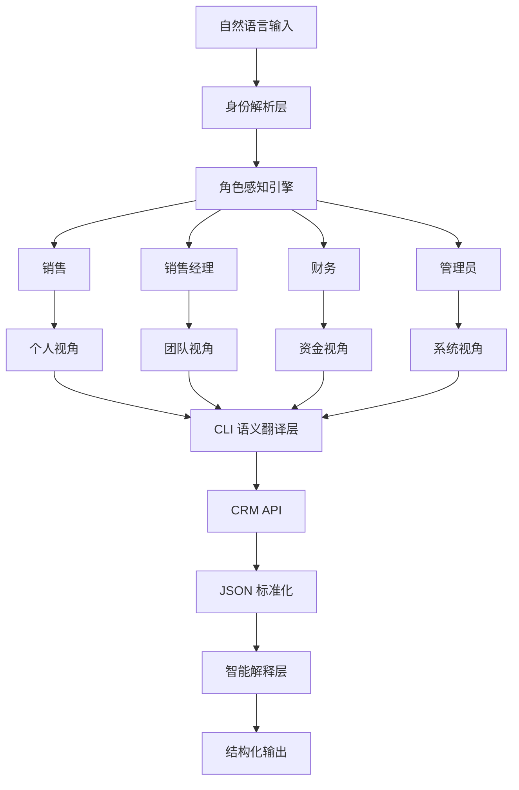

# Cordys CRM Skill

## 会 **认人** 的 CRM AI 助手

一个销售和一个销售经理问同一个问题"看看线索"，得到的应该是不一样的答案：
- 销售想看的是「**我的**线索，哪些该跟进了」
- 经理想看的是「**团队的**线索，谁拖后腿了」

这不是偏好设置，而是**角色的本质差异**。

Cordys CRM Skill 的解法很简单：**让 AI 在开口之前，先知道坐在屏幕前的是谁。**

你只需要输入 API Key，剩下的由系统自动完成：
1. 自动获取你的身份
2. 根据岗位自动匹配角色（销售、经理、财务）
3. 加载该角色的工作模式——查询范围、输出重点、预警规则
4. 开始对话，**就像你已经用了很久一样**

整个过程不超过 3 次 API 调用。

---

## 不同角色，不同世界

### 销售
```
默认视角：我的客户/线索/商机
查询范围：lead, opportunity, account
输出侧重：操作建议——"联系谁 + 做什么 + 先后顺序"
主动预警：超期线索、商机卡点、今日计划未完成
```

### 销售经理
```
默认视角：全部门
查询范围：lead, opportunity, account, org, members
输出侧重：管理决策——排名 + 风险 + 建议
主动预警：跟进率过低、成员低产出、目标落后
```

### 财务
```
默认视角：按本月时间范围
查询范围：contract, contract/payment-plan, invoice
输出侧重：金额精确——汇总 + 明细 + 逾期
主动预警：回款逾期、未开票、计划集中到期
```
---

## 主动预警，而不是被动回答

一个有用的业务助手，应该在用户发现问题之前就主动预警：

```
销售打开线索列表 →
  AI：您有 3 条线索超过 48 小时未跟进，其中 YYY 集团已 5 天未联系

经理查看团队数据 →
  AI：张三名下跟进率仅 40%，低于团队均值 68%

财务查看回款 →
  AI：合同 XX 项目回款已逾期 15 天，金额 ¥15 万
```

这是**角色感知的风险引擎**在自动工作——它知道不同角色关注不同风险，然后在你查询相关数据时顺带提醒。

---


## 怎么做到的



---


四个核心模块各自独立、互不耦合：

| 模块 | 职责 |
|------|------|
| **角色感知引擎** | 检测用户身份、匹配角色、管理 User.md 生命周期 |
| **CLI 语义规范** | 所有命令的定义、参数规则、意图映射 |
| **输出解释层** | JSON → 人类可读的转换规则、角色适配的输出格式 |
| **风险识别引擎** | 各角色的预警条件、触发时机、提醒优先级 |

---

## 能力边界

这个系统的能力建立在清晰的边界之上：

| 能力 | 说明 |
|------|------|
| 自动感知用户角色 | 无需手动配置身份 |
| 角色适配的查询和输出 | 不同角色看到不同的重点 |
| 主动预警和风险提醒 | 在你查询相关数据时自动扫描 |
| 销售到财务全覆盖 | 三种角色默认视角 |
| 零配置初始化 | API Key 即可开始工作 |

---

## 项目结构

```
CordysCRM-skills/
├── README.md                     # 说明文档
└── skills/
    ├── SKILL.md                  # 入口编排
    ├── .env                      # API 凭证（不提交）
    ├── User.md                   # 运行时用户身份（不提交）
    ├── core/
    │   ├── role-engine.md        # 角色感知引擎
    │   ├── cli-spec.md           # CLI 语义规范
    │   ├── output-engine.md      # 输出解释层
    │   └── risk-engine.md        # 风险识别引擎
    ├── profiles/
    │   ├── sales.md              # 销售角色配置
    │   ├── sales-manager.md      # 经理角色配置
    │   └── finance.md            # 财务角色配置
    ├── scripts/
    │   ├── cordys.sh             # Shell CLI
    │   └── cordys.py             # Python CLI（备用）
    └── references/
        └── crm-api.md            # API 文档
```

---
#  快速开始

```bash
# 通过 Clawdhub 安装（推荐，自动处理依赖和更新）
clawdhub install cordys-crm

# 直接使用安装脚本（适合有 Bash 环境的用户）
curl -fsSL https://raw.githubusercontent.com/1Panel-dev/CordysCRM-skills/main/install.sh | bash
```
## 手动安装

```bash
# 克隆 CordysCRM-skills 仓库到 OpenClaw 的 skills 目录 （如果已有同名目录请先备份或删除）版本号可根据需要调整
git clone --branch main https://github.com/1Panel-dev/CordysCRM-skills ~/.openclaw/workspace/skills/CordysCRM-skills
# 将克隆的目录重命名为 cordys-crm
mv ~/.openclaw/workspace/skills/CordysCRM-skills/skills ~/.openclaw/workspace/skills/cordys-crm
# 删除克隆的仓库目录
rm -rf ~/.openclaw/workspace/skills/CordysCRM-skills

```
## 环境配置

```bash 
# 将克隆的目录重命名为 cordys-crm
vi ~/.openclaw/workspace/skills/cordys-crm/.env

# 编辑 .env 文件，配置 Cordys CRM 的 API 访问地址和认证信息

# 示例：
# CORDYS_BASE_URL=https://your-cordys-instance.com
# CORDYS_API_KEY=your_api_key
# CORDYS_API_SECRET=your_api_secret

```

# 安全边界

- `.env` 包含敏感凭证，不要提交版本控制
- `raw` 命令会向指定域名发送你的 API 凭证，仅限信任域名
- 系统默认拒绝非配置域名的请求（可设置 `CORDYS_ALLOW_UNTRUSTED=1` 强制放行）
- 定期轮换 API Key