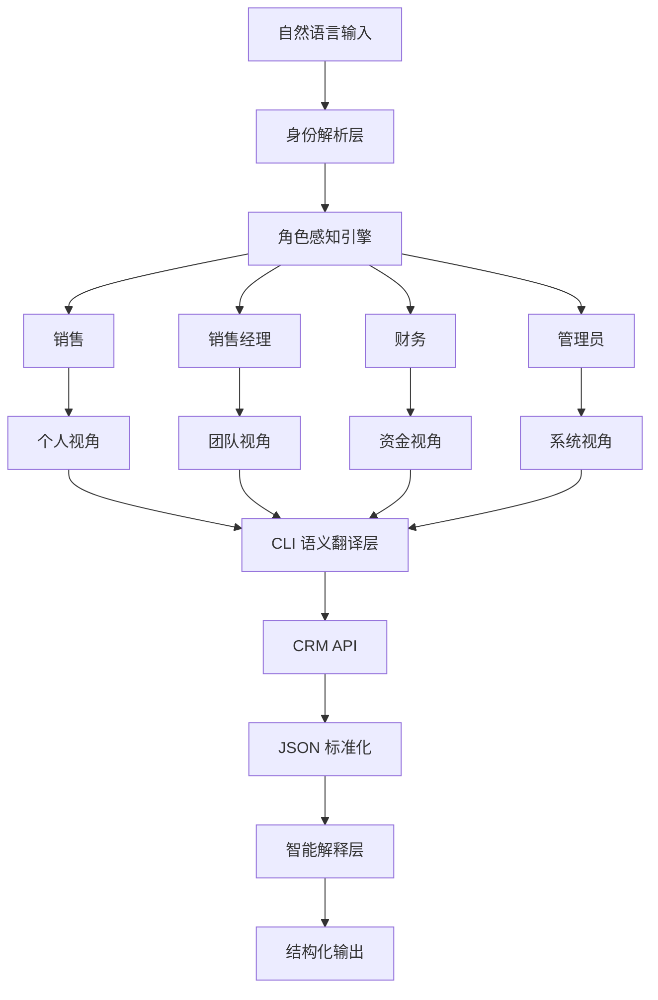

# 🚀 Cordys CRM Skill
## 会“认人”的 CRM AI 助手

> 给 API Key 就够了，其余交给系统自动完成。

---

## 🧠 核心理念

传统 CRM：

> ❌ 你告诉系统“我要看什么”

Cordys CRM Skill：

> ✅ 系统先知道“你是谁”，再决定“你该看什么”

---

## ⚡ 一句话体验

普通 CRM：
→ 你要看什么？

Cordys CRM：
→ 销售经理您好，团队今天新增 12 条线索，其中 3 条已超 48 小时未跟进，需要优先处理。

---

# 🧩 系统架构



---

# 🧠 角色感知能力

角色不是标签，而是**上下文系统**

| 角色 | 默认视角 | 自动关注 |
|------|----------|----------|
| 销售 | 我的客户 | 跟进 / 商机 |
| 销售经理 | 团队 | KPI / 风险 |
| 财务 | 资金 | 回款 / 逾期 |

---

# ⚙️ CLI 命令

```text
cordys crm page <module>
cordys crm get <module> <id>
cordys crm search <module>
cordys crm list <module>
cordys crm follow <module>
cordys crm org
cordys crm members
cordys crm whoami
cordys crm verify
cordys raw <method> <path>
```

---

# 📦 业务模块

```text
lead                 线索
opportunity          商机
account              客户
contract/payment     回款
invoice              发票
quotation            报价单
product              产品
pool/lead            线索池
pool/account         公海
```

---

# 🧠 交互原则

## 1️⃣ 零追问

用户：
> 看看线索

系统：
- 销售 → 我的线索
- 经理 → 团队异常
- 财务 → 忽略（非相关）

---

## 2️⃣ 结果优先

输出顺序：

1. 结论
2. 风险
3. 数据
4. 建议

---

## 3️⃣ 人类可读输出

❌ JSON：
```json
{"total":13,"list":[...]}
```

✅ 输出：
```
本月有 13 条线索，其中 3 条超期：

┌──────────────┬──────────┬────────┐
│ 客户         │ 时间      │ 状态   │
├──────────────┼──────────┼────────┤
│ XXX 公司     │ 05-06    │ 新     │
│ YYY 集团     │ 05-02    │ 超期   │
└──────────────┴──────────┴────────┘
```

---

# 🔐 身份系统

```bash
cordys crm whoami
```

```json
{
  "userId": "10086",
  "role": "sales-manager",
  "org": "sales-1"
}
```

---

## 👤 身份文件

`skills/User.md`

```md
用户ID：10086
姓名：张三
角色：销售经理
部门：销售一部
```

---

# 📁 项目结构

```text
CordysCRM-skills/
├── README.md
├── skills/
│
│   ├── core/
│   │   ├── role-engine.md        # 🧠 角色感知引擎（核心）
│   │   ├── cli-spec.md           # ⚙️ CLI 语义规范
│   │   ├── output-engine.md      # 🧾 输出解释层
│   │   └── risk-engine.md        # ⚠️ 风险识别引擎
│
│   ├── profiles/
│   │   ├── sales.md              # 👤 销售角色配置
│   │   ├── sales-manager.md      # 👔 经理角色配置
│   │   └── finance.md            # 💰 财务角色配置
│
│   ├── scripts/
│   │   ├── cordys.sh             # CLI Shell 版本
│   │   └── cordys.py             # CLI Python 版本
│
│   ├── .env                      # 🔐 API 配置（不提交）
│   └── User.md                   # 🧠 用户身份上下文
│
└── references/
    └── crm-api.md                # 📚 API 文档
```

---

# 🚀 快速开始

```bash
# 通过 Clawdhub 安装（推荐，自动处理依赖和更新）
clawdhub install cordys-crm

# 直接使用安装脚本（适合有 Bash 环境的用户）
curl -fsSL https://raw.githubusercontent.com/1Panel-dev/CordysCRM-skills/main/install.sh | bash
```
## 手动安装

```bash
# 克隆 CordysCRM-skills 仓库到 OpenClaw 的 skills 目录 （如果已有同名目录请先备份或删除）版本号可根据需要调整
git clone --branch main https://github.com/1Panel-dev/CordysCRM-skills ~/.openclaw/workspace/skills/CordysCRM-skills
# 将克隆的目录重命名为 cordys-crm
mv ~/.openclaw/workspace/skills/CordysCRM-skills/skills ~/.openclaw/workspace/skills/cordys-crm
# 删除克隆的仓库目录
rm -rf ~/.openclaw/workspace/skills/CordysCRM-skills

```
## 环境配置

```bash 
# 将克隆的目录重命名为 cordys-crm
vi ~/.openclaw/workspace/skills/cordys-crm/.env

# 编辑 .env 文件，配置 Cordys CRM 的 API 访问地址和认证信息

# 示例：
# CORDYS_BASE_URL=https://your-cordys-instance.com
# CORDYS_API_KEY=your_api_key
# CORDYS_API_SECRET=your_api_secret

```

# 安全边界

- `.env` 包含敏感凭证，不要提交版本控制
- `raw` 命令会向指定域名发送你的 API 凭证，仅限信任域名
- 系统默认拒绝非配置域名的请求（可设置 `CORDYS_ALLOW_UNTRUSTED=1` 强制放行）
- 定期轮换 API Key
